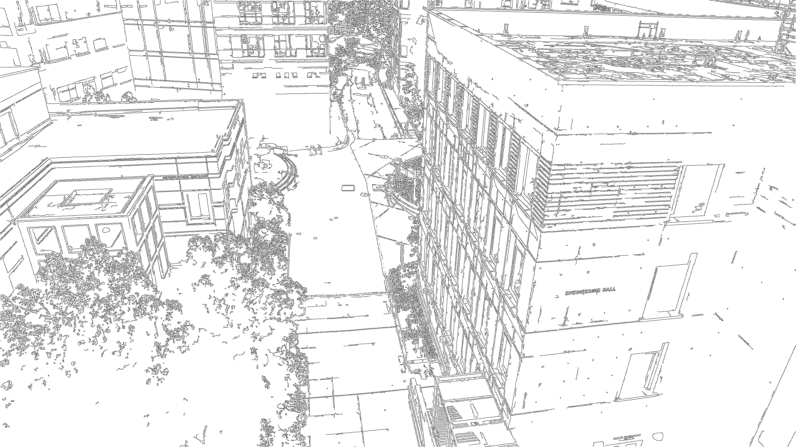

# SystemC-Canny-SoC

## Introduction
In the field of embedded systems and hardware design, simulating system behavior before physical implementation is crucial. This project presents a SystemC-based System-on-Chip (SoC) simulation of the Canny edge detection algorithm—a fundamental technique in image processing and computer vision.
## Why SystemC?
SystemC is a powerful modeling platform that allows designers to simulate and verify hardware and software components at various levels of abstraction. By using SystemC, we can model the concurrency and parallelism inherent in hardware systems, which is not possible with pure C++ programs. This enables early detection of design issues and performance bottlenecks, saving time and resources in the development cycle.
## Project Highlights:
- **Hardware-Level Simulation**: Unlike traditional C++ programs, this project leverages SystemC to simulate the hardware implementation of the Canny algorithm, providing insights into system behavior at the hardware level.
- **Parallel Processing**: Experimental data shows a 13x speedup over sequential image processing, demonstrating the efficiency gains from parallelization in hardware simulations.
- **Modular Architecture**: The simulation is structured into modules representing different hardware components, facilitating scalability and maintainability.

## Architecture
```text=
Top top
|------Stimulus stimulus
|------Platform platform
|       |------DataIn din
|       |------DUT canny
|       |------DataOut dout
|       |------sc_fifo<IMAGE> q1
|       \------sc_fifo<IMAGE> q2
|------Monitor monitor
|------sc_fifo<IMAGE> q1
\------sc_fifo<IMAGE> q2
```
## Module Descriptions
- Top Module (top): The root of the simulation hierarchy, instantiating and connecting all other modules.
- Stimulus (stimulus): Reads input images from the file system and feeds them into the simulation.
- Platform (platform): Contains the core processing units and internal communication channels.
    - DataIn (din): Handles input data buffering and passes images to the DUT.
    - Device Under Test (canny): The main processing unit where the Canny edge detection algorithm is implemented.
    - DataOut (dout): Handles output data buffering and passes processed images to the monitor.
    - Internal FIFOs (q1, q2): Channels for internal data communication between modules within the platform.
- Monitor (monitor): Receives processed images from the platform and writes them to output files.
- Global FIFOs (q1, q2): Channels for communication between the top-level modules.

This modular architecture enables **parallel execution** and **mirrors the data flow in an actual hardware system**, allowing for accurate simulation of system behavior.

## Getting Started
To run the simulation, follow these steps:
#### 1. Install Prerequisites
- SystemC: Download and install SystemC from the [Accellera Systems Initiative](https://www.accellera.org). Follow the installation instructions provided in the documentation.
- C++ Compiler: Ensure you have a C++ compiler installed (e.g., gcc or clang).
- FFmpeg: Install ffmpeg for video processing.
    - Ubuntu/Debian:`sudo apt-get install ffmpeg`
    - macOS (using Homebrew):`brew install ffmpeg`


#### 2. Clone the Repository
```bash
git clone https://github.com/yourusername/SystemC-Canny-SoC.git
```
#### 3. Prepare the Video Directory
```bash
cd SystemC-Canny-SoC
mkdir video
cd video
```
#### 4. Add Your Video Files
Place your own video files into the video directory. The program accepts videos with resolutions of **2704x1520** and **1080x1920** (typical iPhone resolution).
#### 5. Resize the Video (If Necessary)
If your video is not in one of the accepted resolutions, resize it using ffmpeg:
```bash
ffmpeg -i your_video.mp4 -vf scale=2704:1520 resized_video.mp4
```
#### 6. Extract Frames from the Video
Use ffmpeg to extract frames from your video:
```bash
ffmpeg -i resized_video.mp4 -vf fps=30 frame%03d.png
```
**Explanation**:
- `-i resized_video.mp4`: Input file.
- `-vf fps=30`: Extract 30 frames per second.
- `frame%03d.png`: Output file pattern (frame001.png, frame002.png, etc.).
#### 7. Convert PNG Frames to PGM Format
Return to the project root directory and run the conversion script:
```bash
cd ..
chmod +x convert_png_to_pgm
./convert_png_to_pgm video
```
#### 8. Build the Simulation
Compile the SystemC simulation: `make all`
This will generate the canny executable.
#### 9. Run the Simulation
Execute the simulation using `./canny`
The program will process all PGM images in the video directory and generate edge-detected images (e.g., frame001_edge.pgm).
#### 10. View the Results
You can view the output images using an image viewer that supports PGM format or convert them back to PNG **`ffmpeg -i frame%03d_edge.pgm edge%03d.png`**
This command converts the PGM files back to PNG format for easier viewing.


## Project Structure
- `canny.cpp`: The main SystemC simulation source code.
- `convert_png_to_pgm`: Script for converting PNG images to PGM format.
- `video/`: Directory containing input videos and frames.
- `Makefile`: Build configuration for compiling the simulation.
- `README.md`: Project documentation.

## How This Project Differs from a Pure C++ Program
- **Concurrency Modeling**: SystemC allows for the modeling of concurrent processes, which is essential for simulating hardware behavior. In contrast, pure C++ programs are sequential and cannot natively represent hardware concurrency.
- **Hardware Abstraction**: SystemC provides constructs that closely resemble hardware components (e.g., modules, ports, channels), enabling more accurate simulations of SoC architectures.
- **Simulation Kernel**: SystemC includes a discrete-event simulation kernel, which is not available in standard C++. This kernel manages the execution of processes and the timing of events, essential for hardware simulation.
